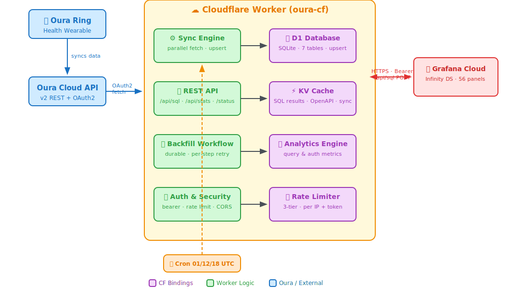

# Oura Ring Data Sync & Analytics Platform

A Cloudflare Worker that syncs Oura Ring health data to a D1 database and serves it to Grafana for visualization and analytics.

[](LICENSE)
[](https://workers.cloudflare.com/)
[](https://www.typescriptlang.org/)

## Features

- **Complete Data Coverage**: Syncs all Oura Ring v2 API endpoints (18+ resources)
- **Automated Sync**: Hourly cron-based data updates
- **Durable Backfill**: Cloudflare Workflows for reliable, retryable historical data sync
- **Grafana Integration**: Pre-built dashboard with 61 visualizations
- **Enterprise Security**: Multi-token auth, timing-safe comparison, 3-tier rate limiting, SQL injection prevention, query timeouts
- **SQL Query Caching**: KV-backed cache with SHA-256 keys, automatic invalidation after sync
- **Analytics Engine**: Query and auth metrics via Cloudflare Analytics Engine
- **Status Page**: `/status` page showing pipeline health, last sync time, and per-table record counts (requires auth)
- **Sync Health Tracking**: Last successful sync metadata written to KV after every cron run
- **Cost-Efficient**: Runs within Cloudflare's free tier limits
- **Test Coverage**: 50 tests (48 passing) covering auth, SQL injection, param validation, CORS, and more
- **Production-Ready**: Comprehensive logging, error handling, observability, and monitoring

## Table of Contents

- [Architecture](#architecture)
- [Quick Start](#quick-start)
- [Data Model](#data-model)
- [API Endpoints](#api-endpoints)
- [Backfill Workflows](#backfill-workflows)
- [Deployment](#deployment)
- [Configuration](#configuration)
- [Cloudflare Access (Optional)](#cloudflare-access-optional)
- [Grafana Setup](#grafana-setup)
- [Development](#development)
- [Contributing](#contributing)
- [License](#license)

## Roadmap / Next Steps

### High Priority

- [ ] **Modularise `src/index.ts`** — the file is ~2,300 lines and contains everything: routing, auth, sync engine, D1 write handlers, OAuth, caching, and the Workflow class. Suggested split:
  ```
  src/
    index.ts           # fetch/scheduled handlers + route wiring only
    types.ts           # Env interface + all shared types
    middleware/
      auth.ts          # validateBearerToken, getBearerRole, logAuthAttempt
      cors.ts          # getCorsOrigins, withCors, security headers
      rate-limit.ts    # getRateLimitKey helpers
    routes/
      health.ts        # GET /health
      sql.ts           # POST /api/sql
      stats.ts         # GET /api/stats
      daily-summaries.ts
      backfill.ts      # GET /backfill + /backfill/status
      oauth.ts         # GET /oauth/start + /oauth/callback
      status.ts        # GET /status
    services/
      oura-api.ts      # fetchWithRetry, circuit breaker, buildOuraUrl
      sync.ts          # syncData, ingestResource
      d1-handlers.ts   # saveToD1 dispatch table (one function per endpoint)
      cache.ts         # hashSqlQuery, flushSqlCache
      token.ts         # getOuraAccessToken, refreshAccessToken, upsertOauthToken
    lib/
      sql-validator.ts # isReadOnlySql, analyzeQueryComplexity, stripComments
      crypto.ts        # constantTimeCompare, hashSqlQuery
      utils.ts         # toInt, toReal, parseResourceFilter
    workflow.ts        # BackfillWorkflow (exported separately)
  ```
- [ ] **Adopt [Hono](https://hono.dev/) router** — replace the `if/else` pathname chain with typed middleware and route groups. Auth, rate-limiting, and CORS become composable middleware applied per-route group rather than duplicated inline. Works cleanly with the module split above.

### Medium Priority

- [ ] **Expand test coverage** — the sync engine, OAuth flow, circuit breaker, and `saveToD1` handlers have no tests. After the module split, these become straightforward unit tests (pure functions or small D1 fixture tests).
- [ ] **D1 backup workflow** — weekly GitHub Actions job running `wrangler d1 export oura-db --remote` and uploading as an artifact (90-day retention).
- [ ] **Data export endpoint** — `GET /api/export?table=daily_summaries&start=...&end=...&format=csv` for ad-hoc data pulls without Grafana.

### Low Priority

- [ ] **Migrate secrets to Cloudflare Secrets Store** — replaces individual `wrangler secret put` calls with a versioned, dashboard-managed store.
- [ ] **Grafana dashboard provisioning** — replace the static JSON import with Grafana Terraform or API-based provisioning so dashboard changes are tracked in source control.

---

## Architecture



```
Oura Ring ──► Oura Cloud API ──► Cloudflare Worker (oura-cf)
                  OAuth2              │
                                      ├── Sync Engine ────► D1 Database (7 tables)
                                      ├── REST API    ────► KV Cache (SQL + spec + sync)
                                      ├── Backfill         Analytics Engine
                                      │   Workflow
                                      └── Auth & Security  Rate Limiter (3-tier)
                                              │
                                              ▼
                                       Grafana Cloud
                                       (Infinity DS · 56 panels)

Cron triggers (01:00, 12:00, 18:00 UTC) ──► Sync Engine
```

### Technology Stack

| Component          | Technology             | Purpose                          |
| ------------------ | ---------------------- | -------------------------------- |
| **Runtime**        | Cloudflare Workers     | Edge computing platform          |
| **Database**       | Cloudflare D1 (SQLite) | Structured data storage          |
| **Cache**          | Cloudflare KV          | SQL query + OpenAPI spec caching |
| **Workflows**      | Cloudflare Workflows   | Durable backfill orchestration   |
| **Analytics**      | Analytics Engine       | Query and auth metrics           |
| **Authentication** | Oura OAuth2            | Secure API access                |
| **Visualization**  | Grafana Cloud          | Dashboards and analytics         |
| **Language**       | TypeScript 5.9         | Type-safe development            |
| **Testing**        | Vitest + Workers Pool  | 50 tests with Miniflare bindings |
| **Deployment**     | Wrangler 4.75+         | CLI deployment tool              |

## Quick Start

### Prerequisites

- [Cloudflare account](https://dash.cloudflare.com/sign-up) (free tier works)
- [Oura Ring](https://ouraring.com/) with active subscription
- [Node.js 22+](https://nodejs.org/) installed
- [Wrangler CLI](https://developers.cloudflare.com/workers/wrangler/install-and-update/)

### Installation

```bash
# Clone repository
git clone https://github.com/xxKeith20xx/oura-cf.git
cd oura-cf

# Install dependencies
npm install

# Configure Cloudflare secrets
npx wrangler secret put GRAFANA_SECRET      # Token for Grafana datasource auth
npx wrangler secret put ADMIN_SECRET        # Token for manual admin operations
npx wrangler secret put OURA_CLIENT_ID      # From Oura developer portal
npx wrangler secret put OURA_CLIENT_SECRET  # From Oura developer portal

# Create D1 database
npx wrangler d1 create oura-db

# Update wrangler.jsonc with your database_id (from previous command)

# Apply database migrations
npx wrangler d1 migrations apply oura-db --remote

# Set your Cloudflare account ID (get from: npx wrangler whoami)
export CLOUDFLARE_ACCOUNT_ID=your-account-id

# Deploy to Cloudflare
npx wrangler deploy
```

### Initial Data Sync

```bash
# Authorize Oura OAuth (visit URL in browser)
curl https://your-worker.workers.dev/oauth/start \
  -H "Authorization: Bearer YOUR_ADMIN_SECRET"

# Complete OAuth flow, then backfill historical data
curl https://your-worker.workers.dev/backfill?days=730 \
  -H "Authorization: Bearer YOUR_ADMIN_SECRET"

# Poll backfill status
curl "https://your-worker.workers.dev/backfill/status?id=INSTANCE_ID" \
  -H "Authorization: Bearer YOUR_ADMIN_SECRET"
```

## Data Model

### Database Schema

**daily_summaries** - Aggregated daily metrics

- Readiness Score (activity balance, HRV, temperature, etc.)
- Sleep Score (efficiency, latency, deep/REM/light sleep)
- Activity Score (steps, calories, training volume)
- Health Metrics (stress, resilience, SpO2, VO2 max, cardiovascular age)
- Sleep Timing (optimal bedtime, recommendation, status)

**sleep_episodes** - Detailed sleep sessions

- Sleep stages (deep, REM, light, awake durations)
- Heart rate (average, lowest)
- HRV, breathing rate, temperature deviation
- Sleep type (long sleep, nap, rest)

**heart_rate_samples** - 5-minute resolution HR data

- Timestamp, BPM, source (ring, workout, etc.)
- High-resolution data for detailed analysis

**activity_logs** - Workouts and sessions

- Exercise type, duration, intensity
- Calories burned, distance, average heart rate
- Meditation and breathing sessions

**enhanced_tags** - User-created tags and annotations

- Tag type, custom name, freeform comments
- Start/end dates with optional duration support

**rest_mode_periods** - Rest mode tracking

- Start/end dates and times
- Episode data (tags during rest mode)

**table_stats** - Pre-computed statistics (cache)

- Row counts, date ranges, last update time
- Reduces database load for dashboard queries

### Data Flow

```
Oura Docs Page → Discover Spec URL → Fetch OpenAPI Spec → KV Cache (24hr)
                                            ↓
                                     18 API Endpoints
                                            ↓
                                   Worker (parallel fetch)
                                            ↓
                                    D1 Database (upsert)
```

**Dynamic Endpoint Discovery**: The Worker auto-discovers available Oura API endpoints by fetching the OpenAPI spec URL from the Oura docs page, with fallback to a known version. This makes the system resilient to Oura API version bumps.

**Upsert Strategy**: Multiple Oura endpoints write to the same `daily_summaries` row (keyed by `day`), allowing data from `daily_readiness`, `daily_sleep`, `daily_activity`, and `sleep_time` to merge into a single denormalized record.

**Resource Aliases**: When Oura renames API endpoints across versions (e.g., `vo2_max` → `vO2_max`), the `RESOURCE_ALIASES` map normalizes names before D1 storage.

## API Endpoints

### Public Endpoints (No Auth)

| Endpoint          | Method | Description                                               | Rate Limit        |
| ----------------- | ------ | --------------------------------------------------------- | ----------------- |
| `/health`         | GET    | Health check (last sync info with auth; debug with admin) | 1 req/60s per IP  |
| `/favicon.ico`    | GET    | Ring emoji favicon                                        | Cached 1 year     |
| `/oauth/callback` | GET    | OAuth2 callback handler                                   | 10 req/60s per IP |

### Authenticated Endpoints (Require Bearer Token)

Rate limit: 3000 requests per minute per IP (applies to all authenticated endpoints)

| Endpoint               | Method | Description                                            | Cache TTL |
| ---------------------- | ------ | ------------------------------------------------------ | --------- |
| `/status`              | GET    | Pipeline status page (HTML) — record counts, last sync | 5 minutes |
| `/oauth/start`         | GET    | Initiate Oura OAuth flow                               | N/A       |
| `/backfill`            | GET    | Start backfill workflow (1 req/60s)                    | N/A       |
| `/backfill/status`     | GET    | Poll backfill workflow status                          | N/A       |
| `/api/daily_summaries` | GET    | Query daily summaries table                            | 5 minutes |
| `/api/stats`           | GET    | Pre-computed table statistics                          | 1 hour    |
| `/api/sql`             | POST   | Execute read-only SQL queries                          | 6 hours   |
| `/`                    | GET    | All daily summaries (sorted by day)                    | 5 minutes |

### Example: Backfill with Workflows

```bash
# Start a backfill (returns immediately with workflow instance ID)
curl "https://your-worker.workers.dev/backfill?days=730" \
  -H "Authorization: Bearer YOUR_ADMIN_SECRET"
# → 202 { "instanceId": "backfill-730d-offset0-...", "statusUrl": "/backfill/status?id=..." }

# Poll status until complete
curl "https://your-worker.workers.dev/backfill/status?id=backfill-730d-offset0-..." \
  -H "Authorization: Bearer YOUR_ADMIN_SECRET"
# → { "status": "running" }  ... then eventually:
# → { "status": "complete", "output": { "successful": 18, "failed": 0, "totalRequests": 42 } }

# Backfill specific resources only
curl "https://your-worker.workers.dev/backfill?days=365&resources=heartrate,sleep" \
  -H "Authorization: Bearer YOUR_ADMIN_SECRET"

# Backfill with offset (skip recent days)
curl "https://your-worker.workers.dev/backfill?days=365&offset_days=30" \
  -H "Authorization: Bearer YOUR_ADMIN_SECRET"
```

### Example: SQL Query (Grafana)

```bash
curl -X POST https://your-worker.workers.dev/api/sql \
  -H "Authorization: Bearer YOUR_GRAFANA_SECRET" \
  -H "Content-Type: application/json" \
  -d '{
    "sql": "SELECT day, readiness_score, sleep_score FROM daily_summaries WHERE day >= date(\"now\", \"-30 days\") ORDER BY day",
    "params": []
  }'
```

## Backfill Workflows

Large backfills use [Cloudflare Workflows](https://developers.cloudflare.com/workflows/) for durable, retryable execution. This solves the fundamental limitation of Workers: CPU time and subrequest limits that made large inline backfills unreliable.

### How It Works

1. **`/backfill`** dispatches a `BackfillWorkflow` instance and returns `202 Accepted` immediately
2. The Workflow runs as a series of durable steps:
   - **`discover-resources`** — Loads available resources from the Oura OpenAPI spec (3 retries)
   - **`sync:{resource}`** — One step per resource (e.g., `sync:heartrate`, `sync:sleep`), each with 3 retries, 5-minute timeout
   - **`update-stats`** — Refreshes the `table_stats` table
   - **`flush-cache`** — Invalidates all cached SQL query results in KV
3. **`/backfill/status?id=<instanceId>`** polls the workflow for progress

### Benefits Over Inline Execution

| Feature           | Previous (inline)                | Workflows                           |
| ----------------- | -------------------------------- | ----------------------------------- |
| **Duration**      | Limited by Workers timeout       | Runs for minutes/hours              |
| **Retries**       | Dead code (syncData never threw) | Per-step with exponential backoff   |
| **Isolation**     | One failure blocks all           | Each resource retries independently |
| **Observability** | Logs only                        | Status polling + structured output  |
| **Idempotency**   | No deduplication                 | Instance IDs prevent duplicates     |

### Cron Sync (unchanged)

The 3x-daily cron sync (`syncData`) remains inline — it only syncs 3 days of data, well within Workers limits. The Workflow is only used for `/backfill`.

## Deployment

### Manual Deployment

```bash
# Run database migrations (if schema changed)
npx wrangler d1 migrations apply oura-db --remote

# Deploy Worker
npx wrangler deploy

# Verify deployment
curl https://your-worker.workers.dev/health
```

### Custom Domain Setup

```bash
# Add custom domain via Cloudflare Dashboard
# Or update wrangler.jsonc:
{
  "routes": [
    {
      "pattern": "oura.yourdomain.com",
      "custom_domain": true
    }
  ]
}

# Deploy with custom domain
npx wrangler deploy
```

## Configuration

### Environment Variables (Secrets)

| Secret               | Required | Description                                     |
| -------------------- | -------- | ----------------------------------------------- |
| `GRAFANA_SECRET`     | Yes      | Bearer token for Grafana datasource auth        |
| `ADMIN_SECRET`       | No       | Separate token for manual admin operations      |
| `OURA_CLIENT_ID`     | Yes      | OAuth2 client ID from Oura developer portal     |
| `OURA_CLIENT_SECRET` | Yes      | OAuth2 client secret from Oura developer portal |
| `OURA_PAT`           | No       | Personal access token (alternative to OAuth)    |
| `ALLOWED_ORIGINS`    | No       | Comma-separated CORS origins                    |
| `MAX_QUERY_ROWS`     | No       | Maximum rows from SQL queries (default: 50000)  |
| `QUERY_TIMEOUT_MS`   | No       | Query timeout in milliseconds (default: 10000)  |

### Wrangler Configuration

Key settings in `wrangler.jsonc`:

```jsonc
{
	"compatibility_date": "2026-02-24",
	"triggers": {
		"crons": ["0 1,12,18 * * *"], // Sync 3x daily
	},
	"workflows": [
		{
			"name": "backfill-workflow",
			"binding": "BACKFILL_WORKFLOW",
			"class_name": "BackfillWorkflow",
		},
	],
	"d1_databases": [
		{
			"binding": "oura_db",
			"database_id": "YOUR_D1_DATABASE_ID",
		},
	],
	"kv_namespaces": [
		{
			"binding": "OURA_CACHE",
			"id": "YOUR_KV_NAMESPACE_ID",
		},
	],
	"analytics_engine_datasets": [
		{
			"binding": "OURA_ANALYTICS",
			"dataset": "oura_metrics",
		},
	],
}
```

### Cloudflare Bindings

| Binding               | Type             | Purpose                              |
| --------------------- | ---------------- | ------------------------------------ |
| `oura_db`             | D1 Database      | Primary data storage                 |
| `OURA_CACHE`          | KV Namespace     | SQL query + OpenAPI spec caching     |
| `BACKFILL_WORKFLOW`   | Workflow         | Durable backfill orchestration       |
| `OURA_ANALYTICS`      | Analytics Engine | Query and auth metrics               |
| `RATE_LIMITER`        | Rate Limit       | Public endpoint rate limiting        |
| `AUTH_RATE_LIMITER`   | Rate Limit       | Authenticated endpoint rate limiting |
| `UNAUTH_RATE_LIMITER` | Rate Limit       | Unauthenticated rate limiting        |

## Cloudflare Access (Optional)

For enhanced security and centralized audit logs, protect API endpoints with Cloudflare Access service tokens.

### Setup

1. **Create Service Token** in Zero Trust Dashboard (Access → Service Auth → Service Tokens)
2. **Create Access Application** protecting your API endpoints
3. **Configure Policy** with Service Auth action
4. **Add Headers to Grafana** datasource configuration:
   - `CF-Access-Client-Id: <token-id>`
   - `CF-Access-Client-Secret: <token-secret>`

### Benefits

- **Observability**: Centralized access logs and analytics
- **Defense in Depth**: Multiple authentication layers
- **Token Rotation**: Supports graceful credential updates

**Note**: Public endpoints (`/health`, `/oauth/callback`, favicons) should remain unprotected to ensure OAuth flow and monitoring continue to function.

## Grafana Setup

### Prerequisites

- Grafana Cloud account (free tier: 10k series, 50GB logs)
- Infinity datasource plugin installed

### Configuration Steps

1. **Install Infinity Plugin**

   ```
   Grafana → Plugins → Search "Infinity" → Install
   ```

2. **Create Datasource**
   - Name: `Oura API`
   - URL: `https://your-worker.workers.dev/api/sql`
   - Method: `POST`
   - Custom HTTP Headers (see below)

3. **Import Dashboard**
   ```bash
   # Use provided dashboard JSON
   cat grafana-dashboard-structured.json
   # Import via Grafana UI ��� Dashboards → Import
   ```

**Custom HTTP Headers Configuration:**

Without Cloudflare Access:

- `Authorization: Bearer YOUR_GRAFANA_SECRET`

With Cloudflare Access (recommended):

- `Authorization: Bearer YOUR_GRAFANA_SECRET`
- `CF-Access-Client-Id: <service-token-client-id>`
- `CF-Access-Client-Secret: <service-token-client-secret>`

### Dashboard Features

- **56 Visualizations** across 11 sections
- **Time-series panels**: Readiness, sleep, activity trends
- **Stat panels**: Current scores, latest metrics, sleep timing
- **Bar charts**: Sleep stages, workout distribution, tag frequency
- **Tables**: Recent tags, rest mode periods, data coverage
- **Correlation analysis**: Sleep quality vs readiness, training load vs recovery

### Example Queries

**Readiness Trend (7-day rolling average)**:

```sql
WITH d AS (
  SELECT day, readiness_score AS score
  FROM daily_summaries
  WHERE readiness_score IS NOT NULL AND day >= date('now', '-2 years')
)
SELECT
  day||'T00:00:00Z' AS time,
  score,
  AVG(score) OVER (
    ORDER BY day ROWS BETWEEN 6 PRECEDING AND CURRENT ROW
  ) AS score_7d
FROM d
ORDER BY day
```

## Security

### Authentication

- **Multi-token auth**: Separate `GRAFANA_SECRET` and `ADMIN_SECRET` for role separation
  - `GRAFANA_SECRET` — read-only access for Grafana datasource
  - `ADMIN_SECRET` — elevated access: enables debug output on `/health`, required for `/backfill` and `/oauth/start`
- **Timing-safe comparison**: Uses `crypto.subtle.timingSafeEqual` (SHA-256 hash both sides first) to prevent timing attacks
- **OAuth state validation**: 24-hour expiry with automatic cleanup via cron
- **Debug header protection**: `/health` request headers (including auth tokens) are never returned to non-admin callers

### SQL Injection Prevention

- **Read-only enforcement**: Blocks INSERT, UPDATE, DELETE, DROP, ALTER, PRAGMA, VACUUM, ATTACH, REPLACE INTO
- **Sensitive table filtering**: Queries against `oura_oauth_tokens` and `oura_oauth_states` are blocked
- **Comment stripping**: Removes `--` and `/* */` comments before validation
- **Multi-statement blocking**: Rejects queries containing semicolons
- **Leading wildcard blocking**: Rejects `LIKE '%...'` patterns that force full table scans
- **LIMIT capping**: Injects/caps LIMIT to prevent unbounded result sets
- **Parameter validation**: Rejects objects/arrays in SQL params (only primitives allowed)

### Rate Limiting

| Tier            | Limit        | Scope                  |
| --------------- | ------------ | ---------------------- |
| Public          | 1 req/60s    | `/health`, backfill    |
| Unauthenticated | 10 req/60s   | Unknown endpoints      |
| Authenticated   | 3000 req/60s | All `/api/*` endpoints |

### Security Headers

All responses include: `X-Content-Type-Options: nosniff`, `X-Frame-Options: DENY`, `X-XSS-Protection: 1; mode=block`, `Referrer-Policy: strict-origin-when-cross-origin`, `Content-Security-Policy: default-src 'none'`

## Development

### Local Development

```bash
# Start local dev server (binds to D1, KV, secrets)
npx wrangler dev

# Access local worker
curl http://localhost:8787/health
curl http://localhost:8787/status   # Pipeline status page (HTML)

# Run tests
npm test

# Run tests once
npm run test:run

# Type checking (clean — no generated types file needed)
npx tsc --noEmit
```

### Testing

The project uses Vitest with `@cloudflare/vitest-pool-workers` for testing against real Miniflare bindings:

```bash
npm test          # Watch mode
npm run test:run  # Single run

# 50 tests (48 passing, 2 skipped)
# Coverage: auth, SQL injection, param validation, LIMIT capping,
#           CORS origins, daily_summaries, 404 handling, root endpoint
```

### Project Structure

```
oura-cf/
├── src/
│   └── index.ts              # Main Worker + BackfillWorkflow (2,300+ lines)
├── test/
│   └── index.spec.ts         # 50 tests
├── migrations/
│   ├── 0001_init.sql         # Core tables
│   ├── 0002_oauth_tokens.sql # OAuth token storage
│   ├── 0003_placeholder.sql  # Numbering placeholder
│   ├── 0004_table_stats.sql  # Pre-computed statistics cache
│   ├── 0005_add_indexes.sql  # Performance indexes
│   ├── 0006_new_endpoints.sql # v1.28 tables (enhanced_tags, rest_mode_periods)
│   ├── 0007_optimize_indexes.sql # Drop redundant indexes
│   ├── 0008_covering_indexes.sql # Covering indexes for Grafana queries
│   ├── 0009_drop_unused_tables.sql # Drop unused tables
│   └── 0010_drop_user_tags.sql # Drop superseded user_tags table
├── scripts/
│   └── sync-version.sh       # Syncs version from package.json → wrangler.jsonc + vitest config
├── wrangler.jsonc            # Cloudflare configuration
├── vitest.config.mts         # Test configuration
├── package.json              # Dependencies
├── tsconfig.json             # TypeScript config
├── grafana-dashboard-structured.json  # Grafana dashboard (56 panels)
├── CHANGELOG.md              # Version history
├── CONTRIBUTING.md           # Contribution guidelines
└── README.md                 # This file
```

### Key Functions

| Function                         | Purpose                                                        |
| -------------------------------- | -------------------------------------------------------------- |
| `BackfillWorkflow.run()`         | Durable backfill with per-resource steps                       |
| `syncData()`                     | Parallel resource fetching orchestrator                        |
| `ingestResource()`               | Fetch data from Oura API with pagination                       |
| `saveToD1()`                     | Transform & save data to D1 (14 endpoints)                     |
| `discoverOpenApiSpecUrl()`       | Auto-discover current Oura API spec URL                        |
| `loadOuraResourcesFromOpenApi()` | Dynamic endpoint discovery from OpenAPI spec                   |
| `getOuraAccessToken()`           | OAuth token management with auto-refresh                       |
| `updateTableStats()`             | Pre-compute table statistics (7 tables)                        |
| `flushSqlCache()`                | Invalidate KV-cached SQL query results                         |
| `hashSqlQuery()`                 | SHA-256 cache key generation for SQL queries                   |
| `isReadOnlySql()`                | SQL injection prevention and query validation                  |
| `getBearerRole()`                | Returns `'admin'`, `'grafana'`, or `null` for a bearer token   |
| `constantTimeCompare()`          | Timing-safe token comparison via timingSafeEqual               |
| `getCorsOrigins()`               | Derives per-request CORS origins from env (no mutable globals) |

### Adding New Oura Endpoints

The system automatically detects new Oura API endpoints via OpenAPI spec. To add a new table:

1. Create D1 migration in `migrations/`
2. Add mapping logic in `saveToD1()` function
3. Deploy migration and Worker

## Contributing

Contributions are welcome! See [CONTRIBUTING.md](CONTRIBUTING.md) for guidelines.

Quick summary:

- Use conventional commit messages (`feat:`, `fix:`, `docs:`)
- Update CHANGELOG.md for notable changes
- Test locally with `npm run test:run` before submitting
- Use `npm version patch|minor|major` to bump versions — the `version` hook auto-syncs `wrangler.jsonc` and `vitest.config.mts`
- Open an issue for major changes before starting work

## AI Development Resources

Working with Cloudflare Workers and need AI assistance? These LLM-optimized resources are designed to help AI tools provide better, more accurate answers:

### LLM-Optimized Documentation

These URLs are specifically formatted for LLMs to consume as context:

- **[Complete Developer Platform Docs](https://developers.cloudflare.com/developer-platform/llms-full.txt)** - Full Cloudflare developer documentation in LLM-friendly text format
- **[Workers Documentation](https://developers.cloudflare.com/workers/llms-full.txt)** - Workers-specific documentation for AI tools
- **[D1 Database Documentation](https://developers.cloudflare.com/d1/llms-full.txt)** - D1 SQL database reference
- **[KV Documentation](https://developers.cloudflare.com/kv/llms-full.txt)** - Workers KV key-value storage
- **[Durable Objects Documentation](https://developers.cloudflare.com/durable-objects/llms-full.txt)** - Stateful object coordination
- **[R2 Documentation](https://developers.cloudflare.com/r2/llms-full.txt)** - Object storage reference
- **[Workers AI Documentation](https://developers.cloudflare.com/workers-ai/llms-full.txt)** - AI inference on the edge
- **[Vectorize Documentation](https://developers.cloudflare.com/vectorize/llms-full.txt)** - Vector database for embeddings
- **[AI Gateway Documentation](https://developers.cloudflare.com/ai-gateway/llms-full.txt)** - AI API caching and observability

### Model Context Protocol (MCP) Servers

Connect your AI tools directly to Cloudflare's infrastructure:

- **[MCP Servers for Cloudflare](https://developers.cloudflare.com/agents/model-context-protocol/mcp-servers-for-cloudflare/)** - Official MCP server integrations
  - **Cloudflare MCP Server** - Query D1, KV, R2, and manage Workers
  - **Wrangler MCP Server** - Deploy and manage Workers directly from AI tools

### How to Use These Resources

**For ChatGPT, Claude, or other LLMs:**

```
Read the Cloudflare Workers documentation: https://developers.cloudflare.com/workers/llms-full.txt

Then help me with: [your question about this project]
```

**For AI Code Editors (Cursor, Windsurf, etc.):**

- Add the `/llms-full.txt` URLs to your project context
- Install MCP servers for real-time Cloudflare API access

**For This Project Specifically:**

```
Context: Cloudflare Worker syncing Oura Ring health data to D1 database
Stack: TypeScript, Workers, OAuth2, D1, KV, Workflows, Analytics Engine, cron triggers
Docs needed: https://developers.cloudflare.com/workers/llms-full.txt
             https://developers.cloudflare.com/d1/llms-full.txt
```

## License

This project is licensed under the MIT License - see the [LICENSE](LICENSE) file for details.

**TL;DR**: You can use, modify, and distribute this code freely. Attribution appreciated but not required.

---

**Project Repository**: [github.com/xxKeith20xx/oura-cf](https://github.com/xxKeith20xx/oura-cf)
